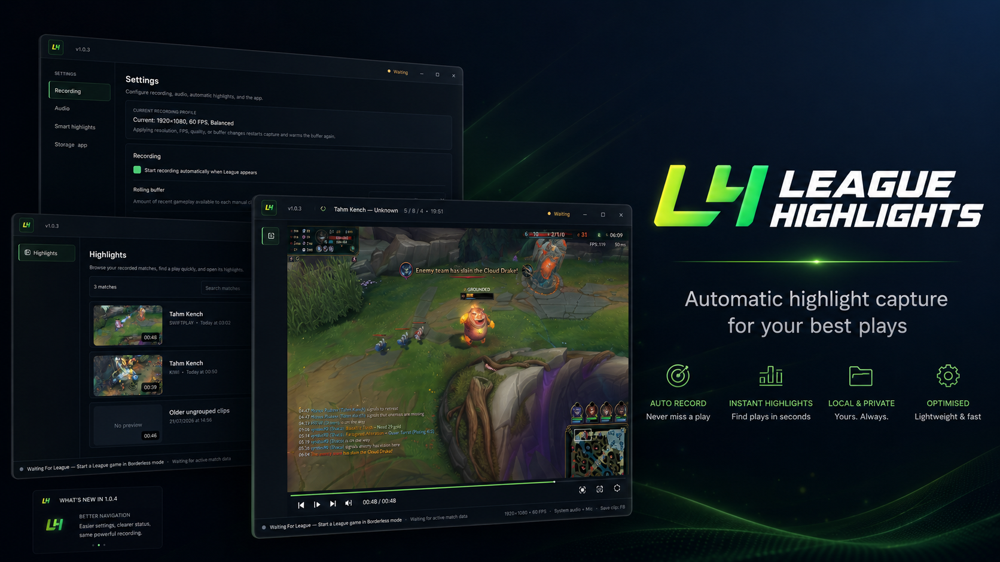

<p align="center">
  
</p>

<h1 align="center">League Highlights</h1>

<p align="center">
  A lightweight, privacy-first League of Legends highlight recorder for Windows.
</p>

<p align="center">
  
  
  
  
</p>

<p align="center">
  
</p>

League Highlights keeps a short rolling buffer while a League match is running. Press a configurable global hotkey to save the latest action, or let Smart Highlights automatically preserve kills, objectives, outnumbered fights, support impact, low-health survivals, and other high-value moments.

The application is designed to stay local. Clips remain on the computer unless the user explicitly exports or sends them.

## Features

### Lightweight recording

- Automatically detects the League of Legends game window.
- Records at 720p, 900p, or 1080p and 30 or 60 FPS.
- Uses FFmpeg Desktop Duplication when available.
- Prefers healthy NVIDIA NVENC, Intel Quick Sync, or AMD AMF hardware encoding.
- Falls back safely when a hardware encoder is unavailable or unhealthy.
- Captures Windows system audio through WASAPI loopback.
- Supports optional microphone capture with separate volume controls.
- Provides encoder, FPS, duplicated-frame, dropped-frame, and capture-backend diagnostics.

### Smart Highlights V2

- Groups related kills, assists, and objective steals into one fight highlight.
- Detects single, double, triple, quadra, and pentakills.
- Detects Dragon, Baron, Elder, ace, and objective steals.
- Recognizes outnumbered plays, including strong 2v1 double-kill situations.
- Scores low-health survival, support impact, converted engages, and teamfight participation.
- Uses adaptive pre-roll and post-roll for longer or higher-value fights.
- Suppresses overlapping automatic clips before they reach the save queue.
- Offers Strict, Balanced, and Save More sensitivity modes.
- Stores explainable score reasons locally.

### Match-based library and player

- Groups highlights by match instead of showing one flat file list.
- Includes match search and Victory or Defeat filters.
- Loads match cards progressively for large libraries.
- Uses an embedded media-first player.
- Shows a match timeline with colored highlight markers.
- Includes trim handles, cached filmstrip previews, fullscreen playback, and Smart Trim suggestions.
- Releases inactive video-player resources when leaving a match.

### Share and export

- Saves separate high-quality share copies without replacing the original highlight.
- Creates size-targeted Discord copies.
- Can reveal exported files in File Explorer immediately.
- Optionally sends through the user's own Discord webhook.
- Protects saved webhook data with Windows DPAPI.
- Keeps heavy FFmpeg jobs off the UI thread and limits concurrent exports.

### Performance and reliability

- Reduces League and metadata polling while no match is active.
- Caches unchanged clip metadata and preview filmstrips.
- Keeps rolling segments and temporary files bounded.
- Cleans stale temporary data left by interrupted sessions.
- Adds low-disk-space protection.
- Validates saved clips before adding them to the library.
- Attempts limited automatic recovery after an unexpected recorder stop.
- Reduces UI refresh frequency while minimized or hidden.

## Privacy

- No Riot API key is required.
- Match context is read from Riot's local Live Client Data API while the game is running.
- Clips, ratings, settings, and metadata are stored locally.
- Gameplay is never uploaded automatically.
- Discord sharing only occurs after an explicit user action.
- Webhook URLs are encrypted and are not written to application logs.

## Requirements

### Packaged application

- Windows 10 or Windows 11, 64-bit
- League of Legends in Borderless or Windowed mode
- Updated graphics and audio drivers

The packaged build includes the Python runtime, FFmpeg, and FFprobe. End users do not need to install Python.

### Development

- Python 3.11 to 3.14
- PowerShell
- Inno Setup 6 for creating the installer

Exclusive fullscreen is not currently supported reliably because capture uses the composed Windows desktop region.

## Development setup

Open PowerShell in the project directory:

```powershell
Set-ExecutionPolicy -Scope Process Bypass
.\setup.ps1
```

Then run:

```powershell
.\run.bat
```

For PyCharm, select:

```text
.venv\Scripts\python.exe
```

and run `main.py`.

## Tests

```powershell
.\.venv\Scripts\python.exe .\scripts\test_smart_highlights_v2.py
.\.venv\Scripts\python.exe .\scripts\test_performance_reliability.py
```

## Build the Windows application

```powershell
.\build_exe.ps1
```

The packaged application is created under:

```text
dist\LeagueHighlights
```

Release assets are created under:

```text
release\<version>
```

A normal release contains:

```text
LeagueHighlights-<version>.zip
LeagueHighlightsSetup-<version>.exe
update.json
SHA256SUMS.txt
```

## Saved files

Highlights:

```text
%USERPROFILE%\Videos\League Highlights
```

Logs:

```text
%LOCALAPPDATA%\LeagueHighlights\logs\league_highlights.log
```

## Project structure

```text
app/
  services/        Recording, Riot events, scoring, trimming, export, and storage
  ui/              PySide6 windows, player, timeline, and dialogs
  assets/          Application logo and Windows icon
docs/images/       README and promotional images
scripts/           Build, test, and FFmpeg setup scripts
main.py            Application entry point
build_exe.ps1      PyInstaller and release build script
setup.ps1          Development setup
```

## Current status

League Highlights is an active Windows desktop project. Core capture, Smart Highlights V2, support detection, match grouping, playback, trimming, diagnostics, automatic updates, tray integration, startup behavior, and export workflows are implemented.

The detector uses Riot's local event and state data rather than expensive video AI. It can understand kills, multikills, assists, health, deaths, objectives, steals, and fight context, but it cannot reliably judge visual mechanics such as skillshot dodges, animation cancels, or mechanically beautiful movement from the video alone.

## Riot Games notice

League Highlights is an independent project and is not endorsed by Riot Games. League of Legends and Riot Games are trademarks or registered trademarks of Riot Games, Inc.
